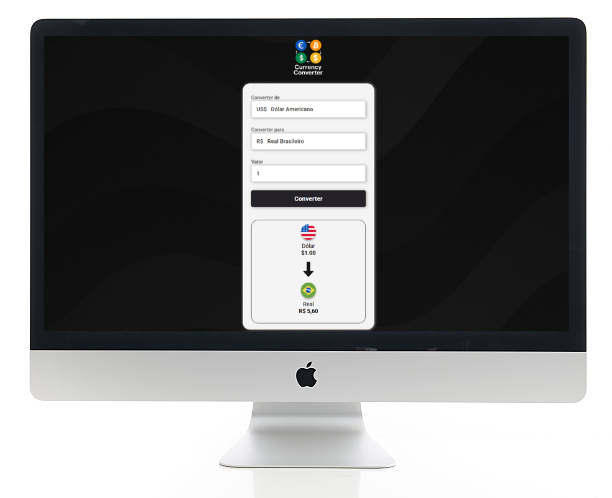

  

# 💱 Desafio Conversor de Moedas

Este é um projeto desenvolvido como desafio de prática em **HTML**, **CSS** e **JavaScript**.

O conversor permite que o usuário selecione uma moeda de origem e uma de destino, insira um valor e veja o valor convertido com formatação personalizada.

---

## 🚀 Funcionalidades

- Conversão entre:
  - Real Brasileiro (BRL)
  - Dólar Americano (USD)
  - Euro (EUR)
  - Bitcoin (BTC)
- Interface intuitiva com imagens e nomes de moedas
- Cálculo dinâmico baseado na moeda de origem
- Formatação correta de acordo com o tipo de moeda

---

## 🖥️ Tecnologias Utilizadas

---
